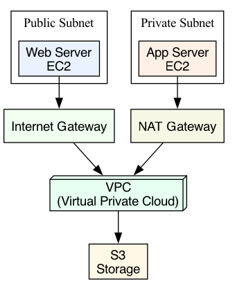

# Multi-Tier Web Application (Terraform + LocalStack)

## Overview

This project builds a three-tier architecture locally, simulating AWS (Amazon Web Services) using Terraform and LocalStack.

## Architecture Layers
- Web Tier: EC2 in public subnets
- Application Tier: EC2 in private subnets
- Data Tier: S3 (Simple Storage Service) bucket storage
- Network Tier: VPC (Virtual Private Cloud), subnets, security groups

## Key Features
- Multi-AZ subnet design
- Public and private subnets
- Security groups with least privilege
- S3 bucket with versioning
- Modular Terraform structure
- Fully local deployment (no AWS account required)

## Requirements
- Terraform 1.0+
- LocalStack
- AWS CLI
- Docker

## Start LocalStack

<pre><code>docker run -d -p 4566:4566 localstack/localstack</code></pre>

## Deploy Infrastructure

<pre><code>cd envs/dev
terraform init
terraform apply -auto-approve
</code></pre>

## Show Terraform Outputs

<pre><code>cd envs/dev
terraform output
</code></pre>

## Auto-Verification Script

<pre><code>#!/usr/bin/env bash
echo "Verifying deployment..."

echo "Terraform Outputs:"
(cd envs/dev && terraform output)

echo "EC2 Instances:"
aws --endpoint-url=http://localhost:4566 ec2 describe-instances \
 --query 'Reservations[].Instances[].[InstanceId,State.Name,PrivateIpAddress]' --output table

echo "S3 Buckets:"
aws --endpoint-url=http://localhost:4566 s3 ls

echo "VPC:"
aws --endpoint-url=http://localhost:4566 ec2 describe-vpcs \
 --query 'Vpcs[].[VpcId,CidrBlock]' --output table

echo "Security Groups:"
aws --endpoint-url=http://localhost:4566 ec2 describe-security-groups \
 --query 'SecurityGroups[].[GroupId,GroupName]' --output table

echo "Complete!"
</code></pre>

## Run Script

<pre><code>chmod +x verify-deployment.sh
./verify-deployment.sh
</code></pre>

## Folder Structure

<pre><code>terraform-multi-env/
├── modules/
│   └── vpc/
│       ├── main.tf
│       ├── variables.tf
│       └── outputs.tf
└── envs/
    └── dev/
        ├── main.tf
        ├── variables.tf
        ├── outputs.tf
        └── terraform.tfvars
</code></pre>

## Architecture Diagram

